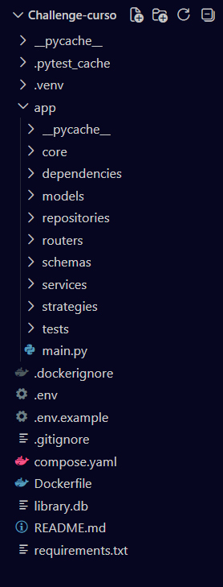

# Notifications API

## Description
**Basic notification management system for authenticated users.** It allows users to register with an email address and password, create notifications through three different delivery channels (Email, SMS, and Push Notifications), and retrieve their own notifications. The system is designed with an extensible architecture, making it easy to add new notification channels in the future.

## Badges
[](https://dl.circleci.com/status-badge/redirect/gh/oscartorres96/Challenge-curso/tree/master)

## Main Features

- User registration with email and password.
- Token-based authentication for protected endpoints.
- Create and manage notifications.
- Deliver notifications through Email, SMS, and Push channels.
- Strategy Pattern implementation for extensible notification delivery.
- Automatically generated API documentation with Swagger UI.

## Architecture
The application follows a layered architecture to promote separation of concerns and maintainability. The **Service** layer encapsulates all business logic, while the **Repository** layer is responsible for data access and database interactions. **Pydantic** models are used to validate and ensure the consistency of data throughout the application.

## Technologies
- Python 3.12
- FastAPI
- SQLAlchemy
- Pydantic
- SQLite
- Docker
- Docker Compose
- Pytest
- Uvicorn

## Project Structure


## Environment Variables
- **DATABASE_URL**: The database connection URL. This project uses SQLite by default.
- **SECRET_KEY**: A secret key used for authentication. It is recommended to use a randomly generated key with at least 48 characters.

## Prerequisites

The recommended way to run the application is with Docker.

### Using Docker

Make sure the following tools are installed:

- [Docker](https://docs.docker.com/get-docker/)
- Docker Compose, included with recent Docker Desktop installations


### Running Locally

To run the application without Docker, you need:

- Python 3.12 or later
- pip
- A Python virtual environment (recommended)

## Getting Started

Clone the repository:

```bash
git clone https://github.com/oscartorres96/Challenge-curso.git
cd Challenge-curso
```

## Running with Docker
1. Build the Docker image:

```bash
docker compose build
```

2. Start the application:

```bash
docker compose up
```

Once the application is running, you can access:

- **API:** `http://localhost:8000`
- **Swagger UI:** `http://localhost:8000/docs`
- **ReDoc:** `http://localhost:8000/redoc`

To stop the application:

```bash
docker compose down
```

## Running Locally

1. Create and activate a virtual environment:

```bash
python -m venv .venv
```

2. Install the dependencies:

```bash
pip install -r requirements.txt
```

3. Configure the environment variables:

Create a `.env` file in the project root and define the required variables.

4. Start the development server:

```bash
uvicorn app.main:app --reload
```

The API will be available at:

```
http://localhost:8000
```

Swagger UI:

```
http://localhost:8000/docs
```
## Running Tests
Run all tests:

```bash
pytest
```

## Coverage
Running command:

```bash
python -m pytest --cov=app --cov-report=term-missing
```

## Adding a New Notification Channel
The notification delivery system is based on the **Strategy Pattern**, making it easy to extend with new delivery channels.

To add a new notification channel:

1. Create a new strategy class in the `strategies` package.
2. Inherit from `DeliveryStrategy`.
3. Implement the required `send()` method.
4. Register the new strategy in `DeliveryService`.

Example:

```bash
strategies: dict[str, DeliveryStrategy] = {
    "email": EmailStrategy(),
    "sms": SMSStrategy(),
    "push": PushStrategy(),
    "whatsapp": WhatsAppStrategy(),
}
```

No other changes are required, allowing the system to remain open for extension while minimizing modifications to existing code.